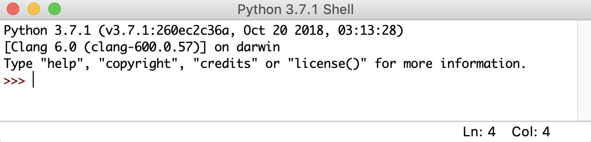

<div dir="rtl">
 
# Learn-Python-In-Arabic 
# تعلم البايثون باللغة العربية 


##  مقدمة 

لكل  مبتدأ في البرمجة بشكل عام وبلغة البايثون بشكل خاص ستكون هذه الصفحة بإذن الله هي نقطة إنطلاقة لتعلم البرمجة بلغة بايثون (Python Programming Language) وسيتم وضع جميع الدورس البرمجية في مجلد [lessons](lessons)


**ملاحظة:- سيتم وضع الدروس الجديده بشكل دوري إما بشكل اسبوعي او شهري**

### المتطلبات 

-  تحتاج إلى تثبيت لغة البرمجة بايثون للنسخة ٣.٥ او اْعلى من خلال الرابط التالي من موقع بايثون الرسمي https://www.python.org/downloads/release/python-379/
 

-  انصح اما بتثبيت او نسخ هذا المستودع البرمجي كما يلي:
   
  
   * تثبيت الملف المضغوط كما هو موضح في الصور
       
        
        
   *  النسخ عن طريق تنفيذ امر git clone
    
   ```git clone https://github.com/nalomran/Learn-Python-In-Arabic.git```
    
###     بيئة تطوير متكاملة (IDE) 

 لك الحرية التامة في إختيار نوع بيئة النطوير المتكاملة أو محرر النصوص. يمكنك كذلك تنفيذ أكواد كل درس من خلال Python console/shell:
    

### البدأ بالدروس 
- فضلاً ابدأ من الدرس رقم صفر (lesson_0.py) تحت مجلد [lessons](lessons)  


### الدروس تحت الإنشاء

- سيتم إضافة دروس جديد لذلك مازال هذا المستوع في طور تطوير


### بالتوفيق للجميع وبرمجة سعيدة 
</div>